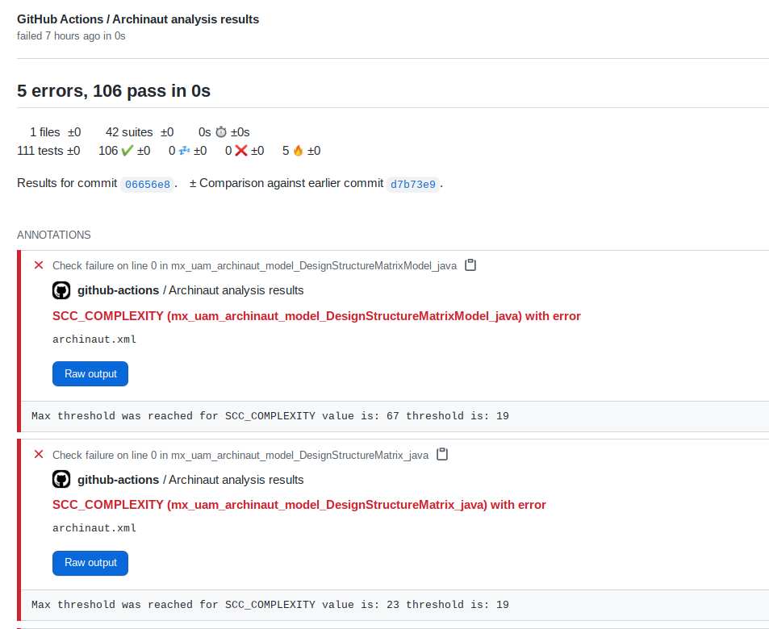
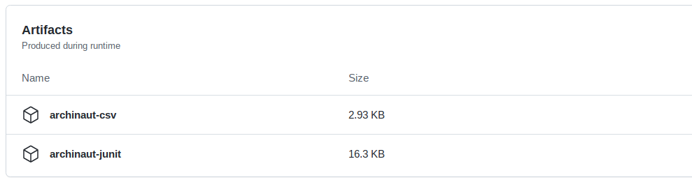

# Archinaut Action

Executes complexity and dependency analysis using [Archinaut](https://github.com/hdmsantander/archinaut) on a _java_ project. It generates metrics and if desired generates an XML JUnit report that allows for a threshold verification on those metrics.

## Basic inputs

These inputs are _needed_ to run the action.

### configuration file

A configuration file with the following format must exist in the root of the project in which the action will run:

_archinaut.yml_

```YAML
---
file: 'scc.csv'
format: 'CSV'
renaming:
  pathSeparator: '/'
  prefix: 'src/main/java/'
  suffix: ''
  substitutions:
    - order: 1
      substitute: '.'
      with: '_'
    - order: 2
      substitute: '/'
      with: '_'
metrics:
  - name: 'Location'
    filename: true
  - name: 'Lines'
    rename: 'SCC_LOC'
  - name: 'Code'
    rename: 'SCC_CLOC'
  - name: 'Complexity'
    rename: 'SCC_COMPLEXITY'
---
file: 'frequencies.csv'
format: 'CSV'
renaming:
  pathSeparator: '/'
  prefix: 'src/main/java/'
  suffix: ''
  substitutions:
    - order: 1
      substitute: '.'
      with: '_'
    - order: 2
      substitute: '/'
      with: '_'
metrics:
  - name: 'entity'
    filename: true
  - name: 'n-revs'
    rename: 'ARCH_REVISIONS'
  - name: 'bugs'
    rename: 'BUG_COMMITS'
  - name: 'added'
    rename: 'LINES_ADDED'
  - name: 'removed'
    rename: 'LINES_REMOVED'
---
file: 'coupling.csv'
format: 'CSV'
renaming:
  pathSeparator: '/'
  prefix: 'src/main/java/'
  suffix: ''
  substitutions:
    - order: 1
      substitute: '.'
      with: '_'
    - order: 2
      substitute: '/'
      with: '_'
metrics:
  - name: 'entity'
    filename: true
  - name: 'cochanges'
    rename: 'COCHANGES'
---
file: 'depends.json'
format: 'DEPENDS'
renaming:
  pathSeparator: '.'
  prefix: 'main.java.'
  suffix: ''
  substitutions:
    - order: 1
      substitute: '.'
      with: '_'
metrics:
  - name: 'Call'
  - name: 'Import'
  - name: 'Return'
  - name: 'Use'
  - name: 'Parameter'
  - name: 'Contain'
  - name: 'Implement'
  - name: 'Create'
  - name: 'Extend'

```

This file is based on the configuration file that [Archinaut](https://github.com/hdmsantander/archinaut) uses to generate the metrics of a project. More information on the file and its settings can be found [here](https://github.com/hdmsantander/archinaut#configuration-file).

### init date

Starting date to analyze the repositorys git log, format is: yyyy-mm-dd. Defaults to last month.

### min cochanges

Minimum number of cochanges to report in coupling analysis. Defaults to zero.

## Threshold inputs

These inputs are _optional_ and serve to generate a JUnit format XML report with the threshold violations.

Given any **metrics** declared in the configuration file, an input can be declared in the action specification, that will work as a threshold to generate a JUnit style XML report with the violations of said thresholds. For example, in the **archinaut.yml** file we specified the metrics _SCC_LOC_, _SCC_CLOC_ and _SCC_COMPLEXITY_, so in the **with** section of the action declaration in the workflow we can declare the following inputs:

- scc loc: 150
- scc cloc: 100
- scc complexity: 15

These inputs will be parsed and used at runtime to generate a JUnit style XML report with the violations detected.

## Outputs

The action generates two files as outputs:

- `archinaut.csv` This file is a CSV with the metrics found in the project for each file of the project.
- `archinaut.xml` This file is a JUnit style XML report containing the metric threshold violations, in case there are any.

Both files can be interacted with and are available at the root of the execution environment of the action.

## Example of usage in a workflow

In order to use the action in a workflow, there must be a step where the action is used. In the following workflow there are five steps:

1. `Checkout` Performs the checkout into the repository to use the contents of the project for the Archinaut analysis.
2. `Archinaut analysis` Performs the Archinaut analysis in the project.
3. `Generate report using Archinaut XML output` Analyzes the XML Junit report produced by Archinaut to evaluate if there were any threshold violations. This uses the [action](https://github.com/EnricoMi/publish-unit-test-result-action) provided by [EnricoMi](https://github.com/EnricoMi).
4. `Upload CSV as artifact` Uploads the CSV report generated by Archinaut as a workflow artifact.
5. `Upload XML as artifact` Uploads the XML report generated by Archinaut as a workflow artifact.

The sample workflow is as follows:

_.github/workflows/main.yml_

```YAML
on: [push]
jobs:
  archinaut-analysis:
    runs-on: ubuntu-latest
    name: A job to perform archinaut analysis of source code
    steps:

      # Check out the repository
      - name: Checkout
        uses: actions/checkout@v2.3.4

      # Use the Archinaut action
      - name: Archinaut analysis
        id: archinaut
        uses: hdmsantander/archinaut-action@main
        with:
          configuration file: archinaut.yml
          init date: '2020-01-01'
          min cochanges: 0
          scc loc: 150
          scc cloc: 100
          scc complexity: 19

      # Use the generated "archinaut.xml" file to report the results in merge requests if there's
      # one associated with this commit
      - name: Generate report using Archinaut XML output
        uses: EnricoMi/publish-unit-test-result-action@v1.7
        if: always()
        with:
         check_name: 'Archinaut analysis results'
         report_individual_runs: true
         github_token: ${{ secrets.GITHUB_TOKEN }}
         files: archinaut.xml

      # Store the Archinaut results artifact
      - name: Upload CSV as artifact
        uses: actions/upload-artifact@v2
        with:
          name: archinaut-csv
          path: archinaut.csv

      # Store the Archinaut JUnit artifact
      - name: Upload XML as artifact
        uses: actions/upload-artifact@v2
        with:
          name: archinaut-junit
          path: archinaut.xml
```

And this workflow results in a report that could look like:



In which some entities failed the [threshold inputs](https://github.com/hdmsantander/archinaut-action#threshold-inputs) declared in the configuration of the action, as they scored over **19** for the _SSC_COMPLEXITY_ metric.

With the following artifacts being created:


